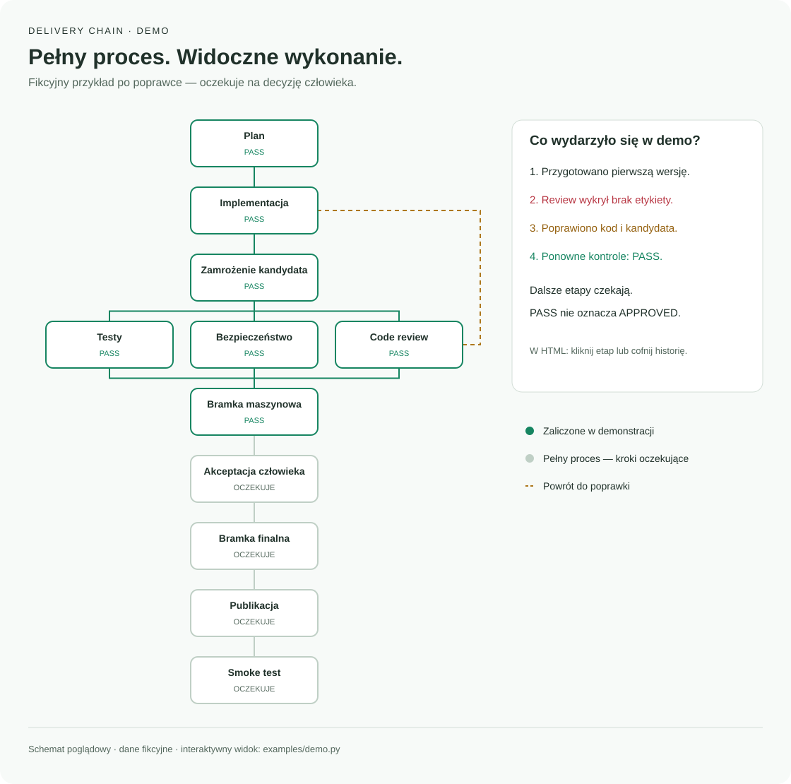

# Delivery Chain — workflow i graf wykonania dla Codexa

A Codex plugin for structured web delivery: planning, independent reviews, release
gates, and an interactive execution graph. Includes eight skills and a local
evidence journal. **Skill instructions, documentation, and the interface are in Polish.**

Plugin Codexa prowadzący pracę nad stroną lub aplikacją webową przez plan,
implementację, weryfikację i odbiór. Zawiera osiem skilli oraz lokalny dziennik
z interaktywnym grafem HTML. Instrukcje i interfejs są po polsku.

## Co pokazuje widok

- Pełny graf chaina z wyróżnieniem wykonanych etapów.
- Osobno: wykonanie kroku, wynik kontroli i akceptację człowieka.
- Historię prób, błędów, poprawek i zmian kandydata.
- Nieaktualne wyniki i publikację przed formalnym odbiorem.
- Notatki i wskazane dowody po kliknięciu etapu.

HTML jest generowany po zapisaniu zdarzenia. Otwarty plik wymaga odświeżenia;
nie jest to automatyczna telemetria ani stale aktualizowany panel Codexa.

## Przykład przebiegu



Statyczny schemat neutralnej demonstracji, nie zrzut interfejsu ani raport
z rzeczywistego wdrożenia. Zielone kroki pokazują wykonanie; szare — dalszą
część pełnego procesu. Przerywana linia oznacza powrót do poprawki po review.

Interaktywny graf z historią zdarzeń wygenerujesz poleceniem:

```bash
python3 examples/demo.py --output /tmp/delivery-chain-demo.html
```

Otwórz zapisany HTML w przeglądarce. Kliknięcie etapu pokazuje jego szczegóły,
a suwak historii pozwala prześledzić kolejne próby.

## Wymagania

- Python 3.10+ oraz macOS lub Linux (`fcntl`); natywny Windows nieobsługiwany.
- CLI nie wymaga instalowania pakietów Python ani połączenia z siecią.
- Instalacja jako plugin wymaga wersji Codexa z poleceniami `codex plugin`.
  Lokalną instalację sprawdzono na codex-cli 0.153.4, macOS i Python 3.14.
  Pozostałe platformy/wersje nie mają osobnego odbioru.

## Instalacja pluginu

```bash
git clone https://github.com/pawel-ciechanowicz/delivery-chain.git
cd delivery-chain
codex plugin marketplace add "$PWD"
codex plugin add delivery-chain@delivery-chain-public
```

Marketplace i instalację z lokalnego klonu sprawdzono w izolowanym profilu
Codexa. Polecenia powyżej dodadzą plugin do profilu, w którym je uruchomisz.
Następnie rozpocznij nową rozmowę, aby Codex wczytał nowe skille.

Przykładowe zlecenie:

> Użyj safe-web-delivery dla tego projektu. Zapisuj przebieg w delivery-view
> i pokaż graf po każdym etapie. Nie publikuj bez mojego zlecenia.

Unikaj jednoczesnego używania lokalnej kopii tych samych skilli i kopii z
pluginu. Plugin nie instaluje serwera MCP, integracji ani hooków systemowych.

## Dziennik bez instalowania pluginu

Z katalogu sklonowanego repo:

```bash
python3 plugins/delivery-chain/scripts/delivery.py --help
python3 plugins/delivery-chain/scripts/delivery.py init \
  --project /absolutna/sciezka/projektu \
  --run-id first-run --title 'Pierwsze wykonanie'
```

Projekt musi już istnieć. Wynik trafia do
`docs/quality/delivery-runs/first-run/index.html` w tym projekcie.
Pełny opis poleceń: [kontrakt dziennika](plugins/delivery-chain/references/journal.md).

## Neutralna demonstracja

```bash
python3 examples/demo.py --output /tmp/delivery-chain-demo.html
```

Otwórz wynik w przeglądarce. Przykład tworzy tymczasowy projekt i fikcyjny
przebieg: błąd review, poprawka, nowy kandydat, zaliczone kontrole i oczekujący
odbiór. Nie publikuje strony, nie rejestruje prawdziwej akceptacji i nie nadpisuje
istniejącego pliku wyjściowego.

## Testy

```bash
python3 -m unittest discover -s plugins/delivery-chain/tests -v
python3 -m unittest discover -s plugins/delivery-chain/skills/safe-web-delivery/tests -v
```

Łącznie 22 testy obejmują m.in. zapis współbieżny, zachowanie historii,
unieważnianie wyników i akceptacji, reguły bramek oraz escaping danych HTML.
Manifest i osiem skilli przeszły walidatory Codexa. Przegląd interfejsu w
przeglądarce nie został ukończony — układ i interakcje wymagają osobnego odbioru.

## Granice zaufania

Dziennik dokumentuje wpisy agenta; nie potwierdza prawdziwości dowodów ani
zgód. `PASS` nie oznacza `APPROVED`. Skrypt nie wykonuje testów, nie publikuje
produktu i nie zastępuje niezależnego review ani rzeczywistej bramki raportów.

Nie zapisuj sekretów, danych klientów ani pełnych logów. `run.json` zawiera
lokalną ścieżkę projektu. HTML pomija to pole, lecz nadal zawiera wpisane notatki
i referencje dowodów — sprawdź je przed udostępnieniem. Lokalny JSON można
ręcznie zmienić; nie jest to dziennik odporny na manipulację.

## Zawartość

`plugins/delivery-chain` jest samodzielnym pluginem. `.agents/plugins/marketplace.json`
pozwala go odnaleźć. Publiczna historia obejmuje wyłącznie ten pakiet, neutralny
przykład i dokumentację; nie zawiera historii projektów, na których pracowano.

Fingerprint snapshotu odrzuca dowiązania symboliczne do katalogów w zakresie kandydata; wykluczone katalogi, np. `node_modules` i `docs/quality`, pozostają pomijane.

## Autor i projekt

Autorem Delivery Chain jest **Paweł Ciechanowicz**. Plugin powstał w ramach
[ai-edu-lab](https://ai-edu-lab.pl/) jako narzędzie do porządkowania pracy
z Codexem: od planu, przez sprawdzanie zmian, po decyzję o publikacji.
Możesz wykorzystać go we własnym projekcie zgodnie z licencją MIT.

## Licencja

[MIT](LICENSE) — Copyright (c) 2026 Paweł Ciechanowicz.
